# Deep Memory Researcher

An intelligent medical research system that combines **ReWOO planning** with **ReAct adaptability** to conduct deep, systematic research through mem0 memory databases.

## 🎯 Core Mission

Transform complex medical queries into comprehensive, evidence-backed research reports through iterative search and adaptive intelligence.

## 🧠 System Architecture

### The 7-Step Flow


## 🔄 Current System Flow (What's Actually Happening)

```mermaid
flowchart TD
    A[User Query] --> B[main.py:process_query]
    
    B --> C[metadata_ingester.create_metadata]
    C --> C1[memory_interface.get_all - Get all memories]
    C1 --> C2[Gemini Flash - Analyze → metadata JSON]
    C2 --> C3{JSON Parse Success?}
    C3 -->|Yes| D[✅ Metadata Ready]
    C3 -->|No| D1[❌ Empty metadata dict]
    
    D --> E[query_processor.process_query]
    D1 --> E
    E --> E1[Combine query + metadata]
    E1 --> E2[Gemini Pro → research plan JSON]
    E2 --> E3{JSON Parse Success?}
    E3 -->|Yes| F[✅ Research Plan Ready]
    E3 -->|No| F1[❌ Fallback plan created]
    
    F --> G[research_engine.rewoo_react_loop]
    F1 --> G
    G --> G1[Initialize ReWOO Planner + ReAct Observer]
    G1 --> G2[Research Step Loop - Max 10 iterations]
    
    G2 --> H[Planner: reason_about_next_search]
    H --> H1[Gemini Pro → reasoning response]
    H1 --> H2{Valid reasoning?}
    H2 -->|Yes| I[Execute search via memory_interface]
    H2 -->|No| I1[Use fallback search 'medical data']
    
    I --> J[Observer: observe_results]
    I1 --> J
    J --> J1[Gemini Pro → observation response]
    J1 --> J2[accumulate_data - Add to context]
    
    J2 --> K{Continue research?}
    K -->|Yes| G2
    K -->|No| L[analysis_engine.analyze_raw_data]
    
    L --> L1[Gemini Pro → analysis JSON]
    L1 --> L2{JSON Parse Success?}
    L2 -->|Yes| M[✅ Analysis Ready]
    L2 -->|No| M1[❌ Fallback analysis]
    
    M --> N[report_generator.generate_report]
    M1 --> N
    N --> N1[Gemini Pro → final report]
    N1 --> O[Display & Save Report]
    
    style C3 fill:#ffebee
    style E3 fill:#ffebee
    style H2 fill:#ffebee
    style L2 fill:#ffebee
```



## 🚨 Current Issues Identified

### Problem 1: JSON Parsing Failures
- **Metadata Step**: LLM may return non-JSON text
- **Query Processing**: Most likely failure point - returns English instead of JSON
- **Analysis Step**: JSON structure mismatches

### Problem 2: Infinite Loop in Research
- Query Processor fails → creates empty research plan
- ReWOO-ReAct defaults to searching "medical data" repeatedly  
- No plan adaptation because original plan is empty

### Problem 3: Missing Debug Visibility
- LLM responses hidden when JSON parsing fails
- Hard to diagnose where the chain breaks

## 📁 File Structure

```
deep_memory_researcher/
├── main.py                    # Entry point & 7-step coordinator
├── config.py                  # API keys, model types, limits
├── prompts.txt               # All LLM system prompts
├── requirements.txt          # Dependencies
├── .env                      # Your API keys (not in repo)
│
├── metadata_ingester.py      # Step 1: Silo analysis
├── query_processor.py        # Step 2: Query → research plan  
├── research_engine.py        # Steps 3-5: ReWOO-ReAct loop
├── analysis_engine.py        # Step 6: Raw data → insights
├── report_generator.py       # Step 7: Final report
├── memory_interface.py       # mem0 wrapper functions
│
└── cache/                    # (Unused - removed caching)
```

## 🚀 Quick Start

### 1. Install Dependencies
```bash
pip install mem0ai python-dotenv rich camel-ai
```

### 2. Set API Keys
Edit `.env` file:
```
GEMINI_API_KEY=your_actual_gemini_key_here
MEM0_API_KEY=your_actual_mem0_key_here
```

### 3. Run the System
```bash
python main.py
```

### 4. Test Mode
```bash
python main.py --test
```

## 💡 Example Queries

- `"Find all diabetic patients and their treatment outcomes"`
- `"What are the most effective pain management approaches?"`
- `"Analyze hypertension treatment patterns across patients"`
- `"Compare diabetes medication effectiveness"`

## 🔧 Technical Details

### Models Used
- **Gemini 2.5 Flash**: Cheap model for metadata analysis (1M context)
- **Gemini 2.5 Pro**: Smart model for research planning, reasoning, analysis

### Search Strategy
- Progressive thresholds: [0.5, 0.4, 0.3, 0.2]
- Fallback to broader searches if no results
- Iterative refinement based on findings

### Key Innovation: Iterative Search Building
Instead of complex single queries, build understanding through:
1. Simple searches: `"patient names"` → get universe
2. Focused searches: `"Maria Garcia diabetes"` → specific details  
3. Progressive accumulation → comprehensive insights

## 🎯 Design Principles

1. **Simple Chain of Events**: Each step passes output to next step
2. **LLM-Heavy Logic**: Let AI handle complex reasoning, code coordinates
3. **Adaptive Intelligence**: System learns and pivots based on findings
4. **Evidence-Based**: Every insight traceable to source memories
5. **Fail Gracefully**: Fallback strategies when components fail

## 📊 Expected Output

### Research Report Format
- **Executive Summary**: Key findings overview
- **Statistical Analysis**: Counts, distributions, patterns
- **Evidence Base**: Specific patient quotes and examples
- **Clinical Insights**: Medical implications
- **JSON Data Blocks**: Structured quantitative findings

### File Outputs
- Markdown report saved with timestamp
- Mixed format: Human-readable + machine-parseable
- Evidence links to original mem0 memory IDs

## 🐛 Debugging

### Debug Output Added
- `🔍 RAW [COMPONENT] LLM RESPONSE:` - Exact LLM output
- `✅ PARSED [COMPONENT]:` - Successfully parsed data
- `🚨 [COMPONENT] JSON ERROR:` - Parsing failures with problematic text

### Common Issues
1. **"Strategy: unknown"** = Query Processor JSON failed
2. **Infinite same searches** = Empty research plan, using fallbacks
3. **"Research Question: Unknown"** = No valid plan passed to research engine

## 🔄 Future Enhancements

- Multi-silo research across different user_ids
- Real-time plan visualization  
- Interactive research guidance
- Custom domain adaptation
- Performance optimization with caching

## 📝 Development Notes

### Key Insight: Chunked Adaptive Research
The system breaks complex medical queries into mem0-friendly chunks, then uses ReAct methodology to adapt the research plan as findings emerge.

Traditional: Plan → Execute → Report
Our Approach: Plan → Search → Adapt Plan → Search → Repeat → Report

This creates a feedback loop that builds comprehensive understanding through simple, iterative discoveries.