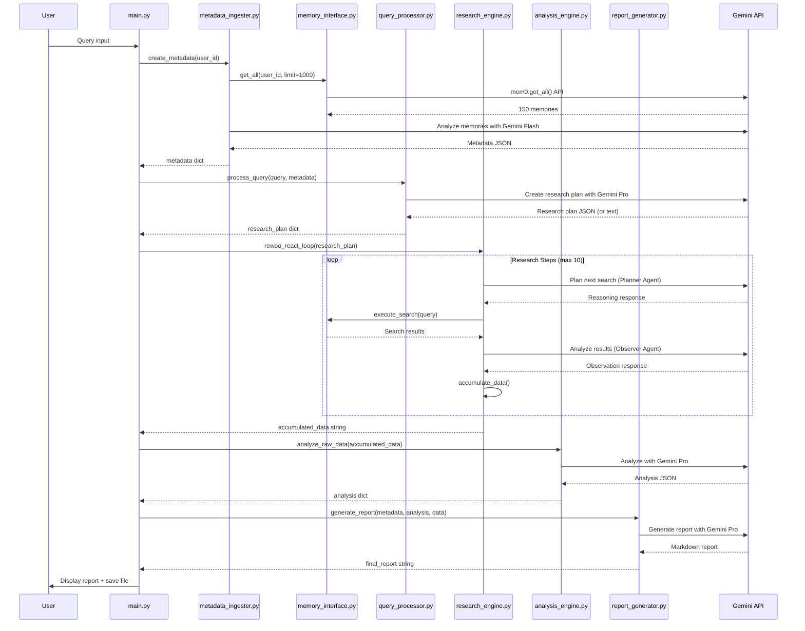

# Deep Memory Researcher - Code Flow Diagram

## Current System Code Flow

```mermaid
flowchart TD
    A[main.py: main()] --> A1[User Input Query]
    A1 --> A2[main.py: process_query(query, user_id)]
    
    %% STEP 1: Metadata Ingestion
    A2 --> B[metadata_ingester.create_metadata(user_id)]
    B --> B1[memory_interface.get_all(user_id, limit=1000)]
    B1 --> B2[mem0.get_all() API call]
    B2 --> B3[Format memories for LLM]
    B3 --> B4[load_prompt('METADATA_ANALYZER')]
    B4 --> B5[ChatAgent + Gemini Flash]
    B5 --> B6[LLM Response]
    B6 --> B7{JSON Parse Success?}
    B7 -->|Yes| B8[Return metadata dict]
    B7 -->|No| B9[Return empty dict {}]
    
    %% STEP 2: Query Processing  
    B8 --> C[query_processor.process_query(query, metadata)]
    B9 --> C
    C --> C1[Combine query + metadata context]
    C1 --> C2[load_prompt('QUERY_PROCESSOR')]
    C2 --> C3[ChatAgent + Gemini Pro]
    C3 --> C4[LLM Response]
    C4 --> C5{JSON Parse Success?}
    C5 -->|Yes| C6[Return research_plan dict]
    C5 -->|No| C7[create_fallback_plan()]
    C7 --> C8[Return basic plan with empty arrays]
    
    %% STEPS 3-5: Research Engine
    C6 --> D[ResearchEngine().rewoo_react_loop(research_plan)]
    C8 --> D
    D --> D1[initialize_agents(): Create planner + observer]
    D1 --> D2[Load prompts: RESEARCH_PLANNER + RESEARCH_OBSERVER]
    D2 --> D3[ChatAgent setup for both agents]
    
    D3 --> E[Research Loop: while step <= MAX_RESEARCH_STEPS]
    E --> E1[reason_about_next_search(plan, context)]
    E1 --> E2[planner_agent.step(reasoning_prompt)]
    E2 --> E3[_parse_reasoning_response(response)]
    E3 --> E4{Valid reasoning?}
    E4 -->|Yes| E5[Get action: SEARCH_BROAD/FOCUSED/GET_ALL]
    E4 -->|No| E6[Default: SEARCH_BROAD, query='medical data']
    
    E5 --> F[execute_search(query, action_type)]
    E6 --> F
    F --> F1{Action Type?}
    F1 -->|SEARCH_BROAD| F2[memory_interface.progressive_search()]
    F1 -->|SEARCH_FOCUSED| F3[memory_interface.search(threshold=0.6)]
    F1 -->|GET_ALL| F4[memory_interface.get_all(limit=50)]
    
    F2 --> G[Progressive Search Loop]
    G --> G1[Try threshold 0.5]
    G1 --> G2{Results found?}
    G2 -->|No| G3[Try threshold 0.4]
    G3 --> G4{Results found?}
    G4 -->|No| G5[Try threshold 0.3]
    G5 --> G6{Results found?}
    G6 -->|No| G7[Fallback: text matching on get_all()]
    G2 -->|Yes| H[Return search results]
    G4 -->|Yes| H
    G6 -->|Yes| H
    G7 --> H
    
    F3 --> H
    F4 --> H
    
    H --> I[observe_results(search_results, original_query)]
    I --> I1[Format results for LLM]
    I1 --> I2[observer_agent.step(observation_prompt)]
    I2 --> I3[_parse_observation_response()]
    I3 --> I4[Extract: insights, patterns, continue_research]
    
    I4 --> J[accumulate_data(query, results, observation)]
    J --> J1[Build results_summary string]
    J1 --> J2[Append to research_context]
    J2 --> J3{Context too long?}
    J3 -->|Yes| J4[Trim context to limit]
    J3 -->|No| J5[Continue with full context]
    
    J4 --> K{Continue research?}
    J5 --> K
    K -->|Yes| E
    K -->|No| L[Return accumulated_data string]
    
    %% STEP 6: Analysis Engine
    L --> M[analysis_engine.analyze_raw_data(accumulated_data)]
    M --> M1[load_prompt('DATA_ANALYZER')]
    M1 --> M2[ChatAgent + Gemini Pro]
    M2 --> M3[LLM Response]
    M3 --> M4{JSON Parse Success?}
    M4 -->|Yes| M5[Return analysis dict]
    M4 -->|No| M6[create_fallback_analysis()]
    
    %% STEP 7: Report Generation
    M5 --> N[report_generator.generate_report(metadata, analysis, data)]
    M6 --> N
    N --> N1[load_prompt('REPORT_SYNTHESIZER')]
    N1 --> N2[ChatAgent + Gemini Pro]
    N2 --> N3[LLM Response - Markdown text]
    N3 --> N4[enhance_report() - Add headers/metadata]
    N4 --> N5[Return final_report string]
    
    %% Display Results
    N5 --> O[main.py: display_results(report)]
    O --> O1[Print report in Panel]
    O1 --> O2[save_report() - Write to file]
    O2 --> O3[End]
    
    %% Error Styling
    style B7 fill:#ffebee
    style C5 fill:#ffebee  
    style E4 fill:#ffebee
    style M4 fill:#ffebee
    
    %% Success Styling  
    style B8 fill:#e8f5e8
    style C6 fill:#e8f5e8
    style M5 fill:#e8f5e8
    style N5 fill:#e8f5e8
```

## Key Components Detail

```mermaid
flowchart LR
    subgraph "config.py"
        A1[USER_ID = 'doctor_memory']
        A2[GEMINI_API_KEY]
        A3[MODEL_TYPES]
        A4[SEARCH_LIMITS]
    end
    
    subgraph "memory_interface.py"  
        B1[search() - Basic mem0 search]
        B2[get_all() - Bulk retrieval]
        B3[progressive_search() - Fallback strategy]
        B4[format_memory_content() - Clean results]
    end
    
    subgraph "prompts.txt"
        C1[METADATA_ANALYZER |]
        C2[QUERY_PROCESSOR |] 
        C3[RESEARCH_PLANNER |]
        C4[RESEARCH_OBSERVER |]
        C5[DATA_ANALYZER |]
        C6[REPORT_SYNTHESIZER |]
    end
    
    subgraph "Core Processing Files"
        D1[metadata_ingester.py]
        D2[query_processor.py] 
        D3[research_engine.py]
        D4[analysis_engine.py]
        D5[report_generator.py]
    end
    
    A1 --> B1
    A2 --> D1
    A3 --> D1
    C1 --> D1
    C2 --> D2
    C3 --> D3
    C4 --> D3
    C5 --> D4
    C6 --> D5
    
    B1 --> D3
    B2 --> D1
    B3 --> D3
    B4 --> D3
```

## Function Call Sequence

