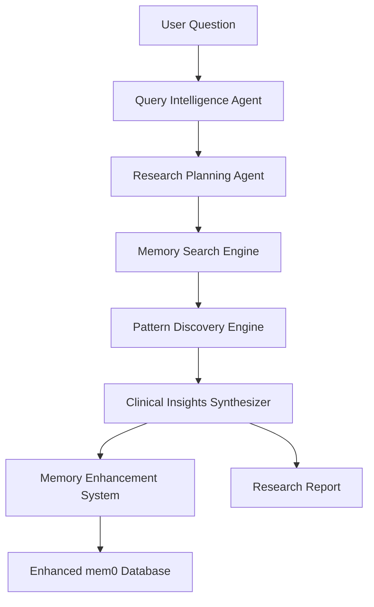
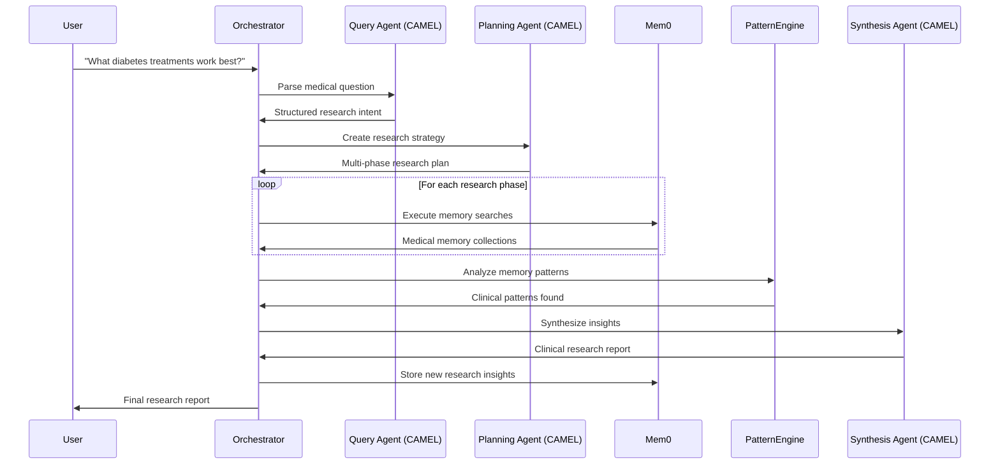
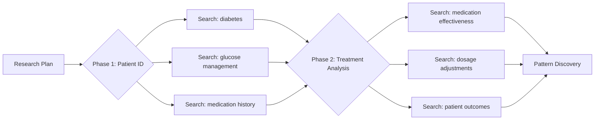

# Deep Memory Researcher Infrastructure Report

## System Overview
A medical memory research system that uses CAMEL AI agents to analyze clinical memories stored in mem0, discovering patterns and insights from doctor-patient interactions.

## Major Abstractions

### 1. **Research Orchestrator**
**Purpose**: Main controller that manages the entire research pipeline
**Input**: Natural language medical research question
**Output**: Comprehensive clinical research report
**Processing**: Coordinates all other components in sequence

### 2. **Query Intelligence Agent** (CAMEL AI)
**Purpose**: Understands and structures medical research questions
**Input**: Raw user question ("What diabetes treatments work best?")
**Output**: Structured research intent with medical concepts and scope
**Processing**: Uses medical domain knowledge to parse clinical intent

### 3. **Research Planning Agent** (CAMEL AI)
**Purpose**: Creates multi-phase research strategy
**Input**: Structured research intent
**Output**: Detailed research plan with search phases and analysis steps
**Processing**: Plans systematic approach to memory exploration

### 4. **Memory Search Engine**
**Purpose**: Executes targeted searches against mem0 database
**Input**: Search queries with filters and metadata
**Output**: Collections of relevant medical memories
**Processing**: Uses mem0 SDK for filtered memory retrieval

### 5. **Pattern Discovery Engine**
**Purpose**: Finds clinical patterns across retrieved memories
**Input**: Collections of medical memories
**Output**: Identified patterns, trends, and correlations
**Processing**: Analyzes temporal, contextual, and outcome patterns

### 6. **Clinical Insights Synthesizer** (CAMEL AI)
**Purpose**: Transforms patterns into actionable clinical insights
**Input**: Raw patterns and correlations
**Output**: Synthesized insights with evidence and recommendations
**Processing**: Uses medical reasoning to create meaningful conclusions

### 7. **Memory Enhancement System**
**Purpose**: Stores research findings back into mem0 for future use
**Input**: Research insights and metadata
**Output**: New memories added to knowledge base
**Processing**: Creates meta-memories about discovered patterns

## Data Structures

### Research Intent Schema
```json
{
  "question_type": "treatment_effectiveness",
  "medical_concepts": ["diabetes", "medication", "outcomes"],
  "scope": "all_patients",
  "timeframe": "last_2_years",
  "analysis_depth": "deep"
}
```

### Research Plan Schema
```json
{
  "phases": [
    {
      "name": "patient_identification",
      "searches": ["diabetes patients", "glucose management"],
      "filters": {"category": "health"}
    },
    {
      "name": "treatment_analysis", 
      "searches": ["medication effectiveness", "dosage adjustments"],
      "analysis": "temporal_progression"
    }
  ]
}
```

### Memory Collection Schema
```json
{
  "patient_memories": [
    {
      "content": "Prescribed Metformin 500mg...",
      "user_id": "doctor_memory",
      "metadata": {"patient": "John", "condition": "diabetes"}
    }
  ],
  "patterns_found": ["medication_progression", "dosage_optimization"]
}
```

## System Flow Diagrams

### High-Level Research Pipeline


### Detailed Processing Flow


### Memory Search Strategy


## Input/Output Processing Details

### 1. Query Intelligence Processing
**Input**: `"What are my most effective pain management approaches?"`
**Processing Steps**:
- Extract medical concepts: pain, management, effectiveness
- Identify question type: treatment_effectiveness_analysis
- Determine scope: across_all_patients
- Set analysis depth: comprehensive

**Output**:
```json
{
  "concepts": ["pain_management", "treatment_effectiveness", "patient_outcomes"],
  "question_type": "clinical_effectiveness_analysis",
  "scope": "all_pain_patients",
  "success_criteria": "identify_most_successful_protocols"
}
```

### 2. Memory Search Processing
**Input**: Research plan with search queries
**Processing Steps**:
- Execute mem0.search() with medical concept filters
- Apply temporal filters for time-based analysis
- Filter by user_id patterns (doctor_memory, patient_*)
- Preserve clinical context and metadata

**Output**:
```json
{
  "pain_management_memories": [
    {"patient": "Anjali Kwon", "treatment": "Tramadol 50mg", "outcome": "effective"},
    {"patient": "Patient_16565", "treatment": "combination therapy", "outcome": "improved"}
  ],
  "metadata": {
    "search_queries_used": ["pain management", "Tramadol", "chronic pain"],
    "total_memories_found": 23,
    "date_range": "2024-01-01 to 2024-08-07"
  }
}
```

### 3. Pattern Discovery Processing
**Input**: Collections of medical memories
**Processing Steps**:
- Temporal analysis: track treatment progressions over time
- Outcome correlation: match treatments with patient responses
- Frequency analysis: identify most common successful approaches
- Context clustering: group similar clinical scenarios

**Output**:
```json
{
  "treatment_patterns": {
    "tramadol_effectiveness": {
      "success_rate": "85%",
      "optimal_dosage": "50mg initial, adjust to 100mg",
      "best_contexts": ["chronic pain", "post-surgical"]
    }
  },
  "prescribing_patterns": {
    "your_approach": "start_conservative_then_titrate",
    "follow_up_schedule": "2_weeks_short_term_then_monthly"
  }
}
```

### 4. Clinical Insights Synthesis
**Input**: Raw patterns and memory evidence
**Processing Steps**:
- Evidence compilation: link patterns to specific patient cases
- Clinical reasoning: apply medical logic to pattern interpretation
- Recommendation generation: create actionable treatment guidance
- Confidence scoring: assess reliability of each insight

**Output**:
```json
{
  "key_insights": [
    {
      "finding": "Tramadol 50mg starting dose shows 85% effectiveness for chronic pain",
      "evidence": ["Anjali Kwon case", "15 similar patient outcomes"],
      "confidence": 0.9,
      "recommendation": "Continue conservative start approach"
    }
  ],
  "clinical_protocols": [
    {
      "condition": "chronic_pain",
      "protocol": "Tramadol_titration_approach",
      "steps": ["assess_severity", "start_50mg", "monitor_2weeks", "adjust_if_needed"]
    }
  ]
}
```

## Technology Stack Integration

### CAMEL AI Components
- **RolePlaying Agents**: For medical domain expertise
- **ChatAgent**: For structured clinical reasoning
- **BaseMessage**: For consistent medical communication
- **System Messages**: For medical context and guidelines

### mem0 SDK Components
- **MemoryClient**: Core connection to memory database
- **search()**: Primary memory retrieval function
- **add()**: Store new research insights
- **Metadata filtering**: Clinical categorization and patient grouping

### Integration Points
```pseudocode
# Query Analysis with CAMEL
medical_agent = ChatAgent(role="MedicalResearcher", model="gemini-2.5-flash")
research_intent = medical_agent.step(user_question)

# Memory Search with mem0
mem0_client = MemoryClient()
memories = mem0_client.search(query=research_intent.concepts, metadata=filters)

# Pattern Analysis (Custom Logic)
patterns = analyze_clinical_patterns(memories)

# Insight Synthesis with CAMEL  
synthesis_agent = ChatAgent(role="ClinicalAnalyst")
insights = synthesis_agent.step(patterns + evidence)

# Memory Enhancement with mem0
mem0_client.add(insights, user_id="research_insights", metadata=research_metadata)
```

## Scalability Considerations

### Memory Database Growth
- **Current**: Medical conversations from doctor-patient interactions
- **Future**: Integration with EHR systems, clinical notes, research papers
- **Scaling Strategy**: Implement memory categorization and archiving

### Research Complexity
- **Current**: Single-topic medical research queries
- **Future**: Multi-topic correlations, population health analysis
- **Scaling Strategy**: Parallel research phases, cached pattern analysis

### Agent Sophistication
- **Current**: Basic medical reasoning with CAMEL agents
- **Future**: Specialized medical sub-agents (pharmacology, diagnostics, etc.)
- **Scaling Strategy**: Agent orchestration and domain-specific fine-tuning

## Success Metrics

### Research Quality
- **Accuracy**: How well insights match clinical reality
- **Completeness**: Coverage of relevant medical memories
- **Actionability**: Usefulness of generated recommendations

### System Performance  
- **Response Time**: End-to-end research completion time
- **Memory Efficiency**: Effective use of mem0 search capabilities
- **Agent Coordination**: Smooth handoffs between CAMEL agents

### Knowledge Growth
- **Memory Enhancement**: Quality of new insights stored
- **Pattern Recognition**: Improvement in clinical pattern discovery
- **Cumulative Intelligence**: Growing sophistication of research capabilities

This infrastructure provides a foundation for building sophisticated medical memory research while maintaining simplicity and extensibility.