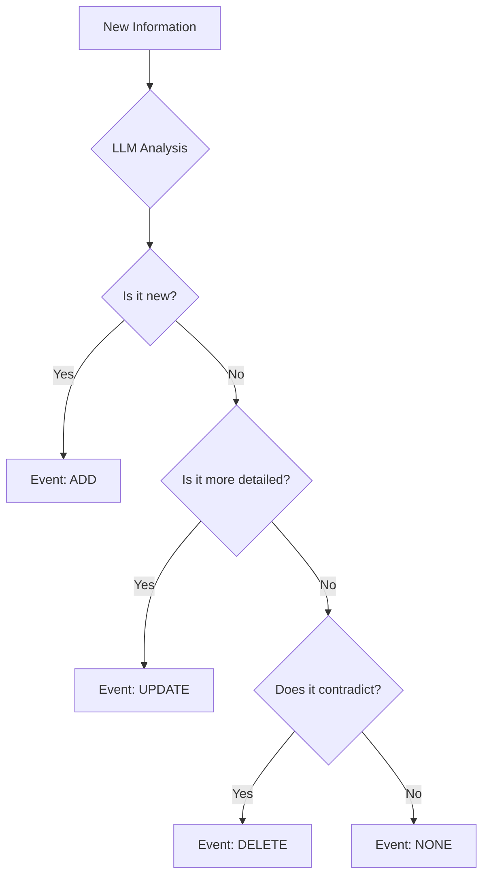

# Inside Mem0: A Developer's Guide to Production-Ready AI Memory

You’ve built a sophisticated AI agent. You’ve given it a whole suite of tools, maybe even connected it to an MCP server. It can search the web, manage calendars, and talk to APIs. But it has a fatal flaw: it’s useless the moment a conversation ends because it can’t remember anything.

This is the next major hurdle in AI engineering. Retrieval-Augmented Generation (RAG) is a good start, but a truly effective agent needs more than just a simple vector search. It needs a reliable, evolving memory architecture that can intelligently decide what to remember, how to update its knowledge, and how to retrieve the right context at the right time.

This guide dives into the architecture of `mem0`, an open-source project designed to solve this exact problem. By examining its core components, we can uncover a blueprint of production-ready patterns for building AI that truly learns.

<!-- Diagram: High-level architecture diagram showing the 3 pillars of Mem0. -->
```mermaid
graph TD
    A[User Input] --> B{Mem0 Memory Layer};
    B --> C[Pillar 1: LLM Intelligence Layer];
    B --> D[Pillar 2: Vector Store];
    B --> E[Pillar 3: Knowledge Graph (Optional)];
    C --> F[Fact Extraction & Decision Making];
    D --> G[Semantic Search];
    E --> H[Relationship Queries];
```

## The Problem: Why Chatbots Forget Everything

Let's start with a simple customer service bot. The user provides their order number. A few messages later, the bot needs it again. A basic implementation without a memory system fails completely.

```python
# The "amnesia" bot
def process_user_message(message, chat_history):
    if "order number" in message:
        # The bot has no memory of the previous turn
        return "I'm sorry, could you please provide your order number again?"
    # ... rest of the logic
```

And that's the core of the problem. The bot has no memory beyond the immediate turn. You could try to solve this by manually parsing the chat history, but that's a fragile solution that breaks easily. How do you build a system that can learn and remember across thousands of conversations?

## The Core Philosophy: Mem0's Three-Pillar Architecture

Digging into the `mem0` codebase reveals a clever three-part system designed to solve this exact problem.

1.  **The LLM Intelligence Layer**: The "brain." It uses an LLM not for chatting, but to analyze conversations and decide what's worth remembering.
2.  **The Vector Store**: The "similarity engine." It stores information as embeddings and finds memories based on meaning, not just keywords.
3.  **The Knowledge Graph (Optional)**: The "relationship mapper." It connects memories, modeling relationships like "Sarah works at Google."

The real magic is how `mem0` uses a factory pattern to let you swap out providers for each pillar. This makes the architecture incredibly flexible.

```python
# mem0/utils/factory.py
class LlmFactory:
    provider_to_class = {
        "openai": "mem0.llms.openai.OpenAILLM",
        "anthropic": "mem0.llms.anthropic.AnthropicLLM",
        "groq": "mem0.llms.groq.GroqLLM",
        # ... and 15+ more
    }

    @classmethod
    def create(cls, provider_name, config):
        # Dynamically loads the correct LLM class based on config
        class_type = cls.provider_to_class.get(provider_name)
        # ... (instantiation logic)
```
This means you can start with a local setup and scale to a cloud-based system just by changing your configuration.

## Pillar 1: The Intelligence Layer - Giving Memory a Brain

This is where the architecture gets really interesting. While many systems use LLMs as simple response generators, `mem0` uses them as a reasoning engine. When you add a memory, it doesn't just store the text. It sends the text to an LLM with a specific set of instructions.

Here’s a simplified version of the prompt from `mem0/configs/prompts.py`:

```python
# mem0/configs/prompts.py

DEFAULT_UPDATE_MEMORY_PROMPT = """
You are a smart memory manager. Compare new facts with existing memory. For each new fact, decide whether to:
- ADD: Add it as a new element.
- UPDATE: Update an existing memory element.
- DELETE: Delete an existing memory element.
- NONE: Make no change.

Guidelines:
1. Add: If the new fact is new information.
2. Update: If the new fact contains more details about an existing memory.
   Example: "User likes cricket" -> "Loves to play cricket with friends". UPDATE the memory.
3. Delete: If the new fact contradicts an existing memory.
   Example: "User lives in New York" -> "User moved to San Francisco". DELETE the old memory.
"""
```

The LLM then returns a structured JSON response with its decisions:

```json
{
  "memory": [
    {
      "id": "existing_id_123",
      "text": "User loves to play cricket with friends",
      "event": "UPDATE",
      "old_memory": "User likes to play cricket"
    }
  ]
}
```
<!-- Diagram: Decision tree illustrating the LLM's logic for ADD/UPDATE/DELETE/NONE memory operations. -->


That's a huge leap from a dumb database.
Your storage system can now reason about the information it holds.

## Pillar 2: Semantic Search with Vector Embeddings

Once the LLM decides what to remember, `mem0` needs a way to retrieve it. This is where the vector store comes in.

The process is simple but powerful:
1.  **Generate Embeddings**: Text is converted into a list of numbers (a vector) that represents its meaning.
2.  **Store Vectors**: These vectors are stored in a specialized database.
3.  **Search**: Your query is also converted into a vector. The database then finds the stored vectors that are mathematically most similar.

This is how you can search for "Italian food" and get a memory about "pizza." The system understands the concepts are related.

Here's a look at the code that generates an embedding:
```python
# mem0/embeddings/openai.py

class OpenAIEmbedding(EmbeddingBase):
    def embed(self, text, memory_action=None):
        # Cleans the text
        text = text.replace("\n", " ")
        # Calls the OpenAI API to get the vector
        return (
            self.client.embeddings.create(
                input=[text],
                model=self.config.model,
                dimensions=self.config.embedding_dims
            ).data[0].embedding
        )
```
And the search itself:
```python
# mem0/vector_stores/qdrant.py

def search(self, query: str, vectors: List[list], limit: int = 5, filters: Optional[Dict] = None) -> List[OutputData]:
    # Uses the generated vector to find similar points in the Qdrant database
    search_result = self.client.search(
        collection_name=self.collection_name,
        query_vector=vectors[0],
        query_filter=self._create_filter(filters),
        limit=limit,
    )
    # ... parsing logic
```
What's impressive is that `mem0` supports over 17 different vector stores, from local options like Chroma to cloud powerhouses like Qdrant.

## Pillar 3: Knowledge Graphs for Explicit Relationships

For many cases, vector search is enough. But for applications that need to understand explicit relationships, `mem0` offers an optional knowledge graph layer.

While a vector store might know that "Sarah" and "Google" appeared in the same conversation, a knowledge graph can store an explicit relationship: `Sarah --[WORKS_AT]--> Google`.

This is done through a similar LLM-powered process called entity extraction.

```python
# Example of an entity extraction query
# "I had a meeting with Sarah from Google about the new search project"

# LLM extracts entities and relationships:
# - (john) -- HAD_MEETING_WITH -- (Sarah)
# - (Sarah) -- WORKS_AT -- (Google)
# - (john) -- DISCUSSED -- (new search project)
```
This layer is powerful for building complex reasoning applications. You could ask, "Who do I know that works at Google?" and the system could traverse the graph to find "Sarah."

## Putting It All Together: The Parallel Magic

The final key to `mem0`'s performance is how it handles these pillars. It would be natural to assume they operate one after another. However, `mem0` uses parallel processing to update all storage systems at the same time.

Here’s the key piece of code from `mem0/memory/main.py`:
```python
# mem0/memory/main.py

from concurrent.futures import ThreadPoolExecutor

# Inside the add method...
with ThreadPoolExecutor() as executor:
    # Submit all storage operations to run at the same time
    future_vector = executor.submit(self._add_to_vector_store, messages, metadata, filters, infer)
    future_graph = executor.submit(self._add_to_graph, messages, filters) if self.enable_graph else None

    # Wait for all operations to complete
    vector_store_result = future_vector.result()
    if future_graph:
        graph_result = future_graph.result()
```
Since the vector, graph, and history updates are independent, they can run in parallel. This dramatically improves performance.

<!-- Diagram: Flowchart visualizing the parallel execution of memory operations using ThreadPoolExecutor. -->
```mermaid
graph TD
    A[memory.add()] --> B{ThreadPoolExecutor};
    B --> C[Task 1: Update Vector Store];
    B --> D[Task 2: Update Knowledge Graph];
    B --> E[Task 3: Log to History];
    C --> F{Wait for all};
    D --> F;
    E --> F;
    F --> G[Return Result];
```

## Key Architectural Patterns in Mem0

The `mem0` codebase is a collection of battle-tested patterns for building real-world AI systems. Here are the key takeaways:

| Pattern | What it is | Why it matters for AI |
| :--- | :--- | :--- |
| **Factory Pattern** | A central class to create objects based on configuration. | Lets you switch between 18+ LLMs and 17+ vector stores without changing code. |
| **Strategy Pattern** | Defining a family of algorithms and making them interchangeable. | Allows different memory strategies (e.g., vector vs. graph) to be used transparently. |
| **Observer Pattern** | An object notifies its dependents of changes. | Vector, graph, and history stores all "observe" and react to memory events in parallel. |
| **Hybrid Storage** | Using multiple database types for different purposes. | Combines the semantic search of vectors with the relational power of graphs. |
| **LLM as a Decider** | Using an LLM for logic, not just text generation. | Creates an intelligent storage system that understands the data it holds. |

## Build Agents, Not Boilerplate

The future of AI is not just about bigger models, but smarter systems. The architectural patterns in this project provide a powerful blueprint for any developer looking to build AI applications that can learn, remember, and reason.

If you're tired of building forgetful bots and want to see what production-ready AI architecture looks like, the `mem0` repository is an excellent place to start. The patterns you'll find there will change the way you think about building with AI.
